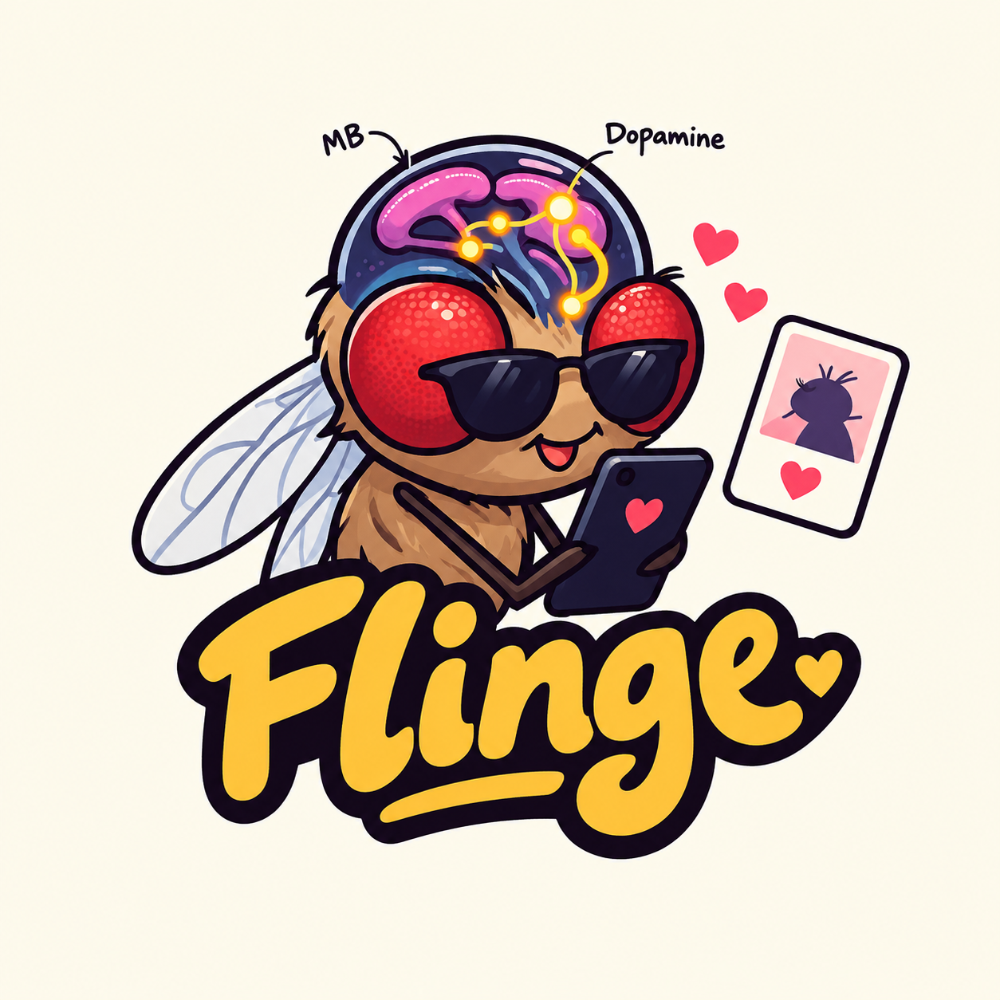
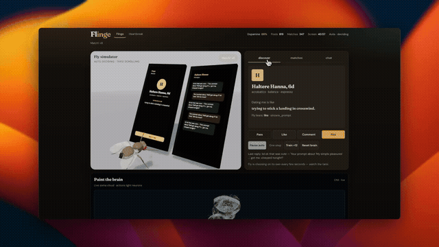

# Flinge

<p align="center">
  
</p>

<p align="center">
  <a href="https://drive.google.com/file/d/1mrS9ScarBsfe_jOycf5fk-UIIQJGmP0b/view?usp=sharing">
    
  </a>
</p>

<p align="center">
  <a href="https://drive.google.com/file/d/1mrS9ScarBsfe_jOycf5fk-UIIQJGmP0b/view?usp=sharing"><strong>▶ Full demo (mp4)</strong></a>
</p>

Train a fruit fly to hinge — a MaleCNS-inspired mushroom-body dopamine loop, a Hinge-style dating UI, and an optional heartbreak recovery curriculum.

**Honesty:** Reward and aversive pulses are engineered (PAM-like / PPL1-like). The default circuit is a deterministic synthetic stand-in sized after MaleCNS MB populations — not the full released synapse graph. This is not clinical advice, and the fly does not understand dating.

## What’s here

| Path | Role |
|------|------|
| [`flinge/`](flinge/) | Python package: MB brain, dating loop, heartbreak engine, FastAPI |
| [`flinge-ui/`](flinge-ui/) | React + Three.js UI (Discover / Matches / Chat + live brain HUD) |
| [`Makefile`](Makefile) | Start / stop API + UI together |
| [`flinge.png`](flinge.png) / [`flinge-demo.gif`](flinge-demo.gif) | Logo + preview GIF ([full demo on Drive](https://drive.google.com/file/d/1mrS9ScarBsfe_jOycf5fk-UIIQJGmP0b/view?usp=sharing)) |
| [`runs/flinge/`](runs/flinge/) | Session state, gains, heartbreak curriculum |
| [`try/fruitless/`](try/fruitless/) | Source fly meshes + brain point cloud (copied into `flinge-ui/public/`) |

UI routes:

- `/` — Flinge dating + fly simulator + “Paint the brain”
- `/heartbreak` — seven-stage breakup recovery (Ambivalence → Growth)

## Setup

```sh
# Backend
cd flinge
python3.11 -m venv .venv
source .venv/bin/activate
pip install -e '.[test]'
python -m flinge prepare

# Frontend
cd ../flinge-ui
npm install
```

Optional OpenAI rizz: copy [`.env.example`](.env.example) → `.env` and set `OPEN_AI_KEY=...`.

## Run (API + UI)

From the repo root:

```sh
make start    # API :8765 + UI :5173
make status
make stop
```

Then open:

- http://localhost:5173
- http://localhost:5173/heartbreak

Vite proxies `/api` to the FastAPI server. Logs and PIDs live in `.run/` (gitignored).

Individual targets: `make start-api`, `make stop-api`, `make start-ui`, `make stop-ui`.

Ports can be overridden: `make start API_PORT=8765 UI_PORT=5173`.

## Train / CLI

With the `flinge` venv active:

```sh
cd flinge
python -m flinge prepare
python -m flinge train --steps 40 --reset
python -m flinge train --steps 8 --llm   # needs OPEN_AI_KEY
python -m flinge status
python -m flinge validate
python -m flinge serve --port 8765
```

| Command | Purpose |
|---------|---------|
| `prepare` | Build MB circuit + profile deck |
| `train --steps N` | Dating loop with dopamine learning |
| `train --llm` | Same, with OpenAI-filled rizz / replies |
| `step [--action like]` | One observation |
| `status` | Dopamine, matches, synaptic depression |
| `serve` | FastAPI for the web UI |
| `validate` | Frozen vs trained mechanism check |

Heartbreak API (same server): `/api/heartbreak/{snapshot,step,train,reset}`.

## Loop (dating)

1. Render a female profile card → PN activity
2. Mushroom body readout → pass / like / comment / rizz
3. Scripted or LLM replies → dopamine meter delta
4. Meter change above deadband → reward or aversive DAN pulse + KC→MBON depression

## Loop (heartbreak)

Separate MB curriculum on `/heartbreak`. Healing actions (`rest` / `accept` / `grow`) advance stage progress; rumination / reach-out / bargaining set it back. Stages: Ambivalence → Shock and Denial → Anger → Bargaining → Depression → Acceptance → Growth.

## Docs

- [flinge/docs/model.md](flinge/docs/model.md) — circuit & learning notes
- [flinge/docs/validation.md](flinge/docs/validation.md) — mechanism checks
- [flinge/README.md](flinge/README.md) — backend detail
- [flinge-ui/README.md](flinge-ui/README.md) — UI detail
